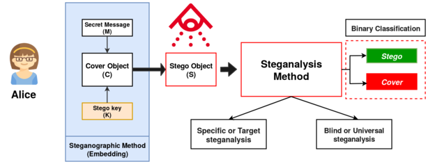

# Steganalysis using Machine Learning
This Repository supports the experiments and machine learning implementation for "Steganalysis using Machine Learning" research.

#### What is Steganalysis?
Steganography   is   a   combination   of   two   words “steganos”  and  “graphia”  meaning  “Covered  Writing”.  It  is  amethod  of  secret  communication  where  no  one  other  than  theparties  directly  involved  (sender  and  receiver)  are  aware  of  itsexistence.  Steganalysis  is  the  process  of  detection  of  messageshidden  by  the  means  of  Stenography.  The  hidden  message  canbe  in  the  form  of  an  audio  file,  an  image,  a  video  file  or  plaintext (may or may not be encrypted).  

#### Environment and Setup
We have use Google Cloud Platform's Compute Engine Instances and Jupyter Notebook.

#### Experimetnts
1). [SRNet](https://github.com/Smit2896/Steganalysis/blob/main/SRNet.ipynb)  
- On unbalanced 400 cover + stego images  
- 10 hours
 
2). [SRNet #2](https://github.com/Smit2896/Steganalysis/blob/main/SRNet_2.ipynb)  
- On balanced 400 cover + stego images  
- 18 hours
